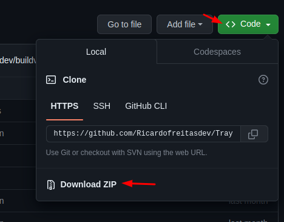
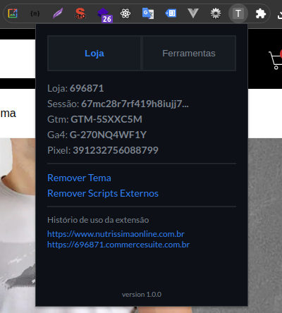

# Tray Chrome extension

Extensão do chrome com recursos que facilitam o trabalho com lojas Tray.

## Uso

Para usar a versão simples no seu navegador, basta seguir as orientações:

Click em `code` > `download ZIP`



Descompacte o ZIP na sua pasta de preferência

Acesse `chrome://extensions/` com o modo do `desenvolvedor` ativo, click em `carregar sem compactação`, localize a pasta descompactada e click em `selecionar`

Com Isso a extensão já irá carregar



## Recursos

Aba Loja

Dados da loja

- ID da loja
- ID da sessão
- Código do GTM
- Código do GA4
- Código do Pixel do Facebook

Úteis

- Remover Tema
- Remover Scripts Externos
- Report de scripts inlines bloqueados por CSP

Histórico de uso da extensão

- Histórico das últimas 4 lojas visitadas.

Aba Ferramentas

- Gerar CPF com um click
- Limpar localStorage
- Whats My Dns
- Pagespeed
- Search Console
- Sitemap
- Robots
- Tag Assistant
- Documentação de APIs
- Documentação de Temas

## Desenvolvimento

Clone o repositório

```sh
git clone https://github.com/Ricardofreitasdev/Tray-chrome-extension.git
```

Entre na pasta do projeto

```sh
cd Tray-chrome-extension
```

Instale as dependencias

```sh
yarn install
```

Execute a aplicação

```sh
yarn dev
```

Após desenvolvimento faça o build

```sh
yarn build
```
